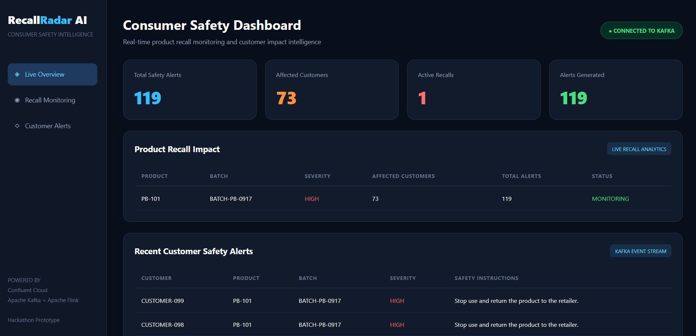
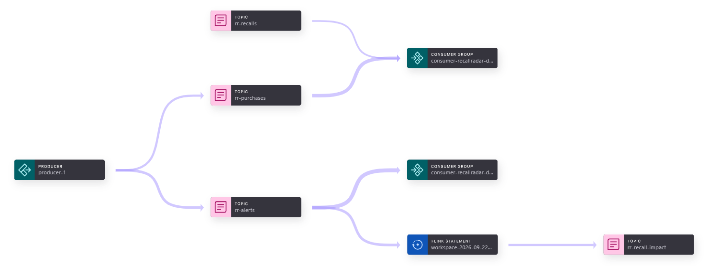

# RecallRadar

### Real-Time Product Recall Intelligence Powered by Confluent Cloud

RecallRadar is an event-driven consumer safety application that helps
retailers identify customers who have purchased recalled product batches.

The application continuously processes retail purchase and product recall
events, generates customer-specific safety alerts, and displays recall
impact through a live web dashboard.



This project was built for Confluent AI Developer Day.

---

## The Problem

When a manufacturer announces a product recall, retailers need to
identify affected purchases and determine which customers may have
received the recalled product.

Purchase records, product information, and recall announcements may
exist across different systems.

Delays in correlating this information can slow down customer safety
responses.

RecallRadar demonstrates how event streaming can help identify affected
purchases as recall information becomes available.

---

## How It Works


1. Simulated retail purchase events are published to Confluent Cloud Kafka.

2. Product recall announcements are published to a separate Kafka topic.

3. A Java detection service consumes both event streams and correlates
   purchases with recalls using product and batch identifiers.

4. Matching purchases generate customer-specific safety alert events.

5. Apache Flink SQL continuously aggregates recall alerts to calculate
   recall impact statistics.

6. A Spring Boot web application consumes customer alerts and displays
   live information through a dashboard.

---

## Architecture

```text
Purchase Producer              Recall Producer
       |                              |
       v                              v
  rr-purchases                    rr-recalls
       |                              |
       +---------------+--------------+
                       |
                       v
             Java Detection Service
                       |
                       v
                   rr-alerts
                       |
             +---------+---------+
             |                   |
             v                   v
       Apache Flink         Spring Boot
             |                   |
             v                   v
      rr-recall-impact       Web Dashboard
```

Apache Flink maintains recall-level aggregate statistics.

The Spring Boot dashboard currently consumes individual customer
alert events and calculates its displayed metrics independently.

---

## Technology Stack

- Java 17+
- Spring Boot
- Apache Kafka
- Confluent Cloud
- Apache Flink SQL
- Confluent Schema Registry
- Maven
- HTML, CSS, and JavaScript

---

## Kafka Topics

| Topic | Purpose |
|-------|---------|
| rr-purchases | Retail purchase events |
| rr-recalls | Product recall announcements |
| rr-alerts | Customer-specific recall alerts |
| rr-recall-impact | Flink-generated recall impact analytics |

---

## Features

- Real-time ingestion of simulated retail purchase events
- Product and batch-level recall matching
- Detection of purchases made before or after a recall announcement
- Customer-specific safety alert generation
- Continuous recall impact aggregation with Apache Flink SQL
- Live web dashboard
- JSON Schema registration for customer alerts

---

## Running the Application

### Prerequisites

- Java 17 or later
- Maven
- A Confluent Cloud Kafka cluster
- Kafka API credentials with access to the required topics

### Configure Kafka credentials

Set these environment variables locally:

```text
KAFKA_BOOTSTRAP_SERVERS=your-bootstrap-server:9092
KAFKA_API_KEY=your-kafka-api-key
KAFKA_API_SECRET=your-kafka-api-secret
```

Never commit actual API credentials to the repository.

### Build the application

```bash
mvn clean package
```

### Start the application

Run:

```text
com.recallradar.RecallRadarApplication
```

Open the dashboard:

```text
http://localhost:8080
```

### Generate events

Run the Java classes in the following order:

1. PurchaseProducer
2. RecallProducer
3. RecallDetectionService

Keep RecallDetectionService running to process additional events.

The dashboard consumes the alert stream and displays updated metrics.

---

## Apache Flink SQL

The application uses Confluent Cloud for Apache Flink to calculate
recall-level impact statistics.

The continuous aggregation calculates:

- Unique affected customers
- Total customer safety alerts
- Recall-level product and batch information

The resulting analytics are published to the rr-recall-impact topic.

---

## Prototype Limitations

This is a hackathon prototype using simulated retail transactions and
fictional recall announcements.

The Java detection service currently maintains its matching state
in memory.

The application generates customer safety alert events but does not
send external email or SMS notifications.

The dashboard calculates its displayed metrics from the alert topic;
the Flink-generated analytics stream is available separately.

AI-generated explanations, managed enterprise connectors,
automated checkout blocking, and customer notification delivery
are potential future extensions, not features implemented in this version.

---

## Future Improvements

- Durable and fault-tolerant recall matching
- Managed database and supplier data connectors
- AI-assisted generation of customer-friendly recall explanations
- Real-time inventory monitoring
- Retail checkout stop-sale integrations
- Email, SMS, and push notification delivery
- Persistent alert deduplication and audit trails

---

## Disclaimer

RecallRadar is a demonstration application.

All retail transactions, customers, products, and recall announcements
used in the prototype are simulated.

It is not intended for production consumer safety decisions without
verified recall data, appropriate controls, and further validation.

### Live Demonstration

[Watch RecallRadar in action](https://drive.google.com/file/d/1Qx3god6o4qW3Jyo1g9Rvu2MTkO-0xJFt/view?usp=sharing)
```